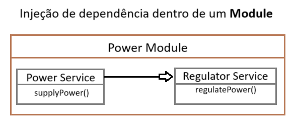
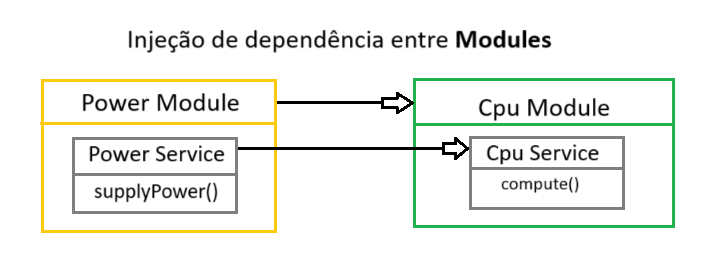

# Nest.js DI (Dependency Injection)

This is chapter 6 in the Nest.js Udemy course found here: [Nest.Js – The complete developers guide](https://www.udemy.com/course/nestjs-the-complete-developers-guide/)

## Dependency Injection

### DI... what?

DI is a design pattern that allows us to create loosely coupled code. It allows us to write code that is more modular, reusable, and testable.

### How to use in Nest?

We use DI by creating a class that will be injected into another class. We then use the `@Injectable()` decorator to mark the class as injectable. We then use the `@Inject()` decorator to inject the class into another class.

## Project

we're going to create a simple project to simulate a computer.
First we're deleting the files (except main.ts) in the project (auto-generated using `nest new nestjs-di`) and starting from scratch.

### Setup the project

Let's setup the project using Nest CLI:

```bash
# Generate the modules
nest g module computer
nest g module cpu
nest g module disk
nest g module power

# Generate the services
nest g service cpu
nest g service disk
nest g service power

# Generate the controllers
nest g controller computer
```

### Share services between modules

Our disk and cpu modules require some power to work correctly. After adding a `supplyPower(watts: number)` method to the power service, we can inject the power service into the cpu and disk services.




#### 1. Export the power service

We need to export the power service from the power module so that we can use it in other modules.

```ts
// power.module.ts
@Module({
  providers: [PowerService],
  exports: [PowerService], // <-- Export the power service
})
```

#### 2. Import the power service

We can now import the power service into the cpu and disk modules.

```ts
// cpu.module.ts
// disk.module.ts
@Module({
  imports: [PowerModule], // <-- Import the power module
  providers: [CpuService],
})
```

#### 3. Inject the power service

We can now inject the power service into the cpu and disk services.

```ts
// cpu.service.ts
// disk.service.ts
@Injectable()
export class CpuService {
  constructor(private powerService: PowerService) {} // <-- Inject the power service
}
```

Now we can use the service by calling e.g. `this.powerService.supplyPower(100)`.

#### 4. Add the disk and cpu services to the computer module

We can now add exports to the cpu and disk modules and then import them in the computer module:

```ts
// computer.module.ts
@Module({
  imports: [CpuModule, DiskModule], // <-- Import cpu & disk modules
  controllers: [ComputerController],
})
```